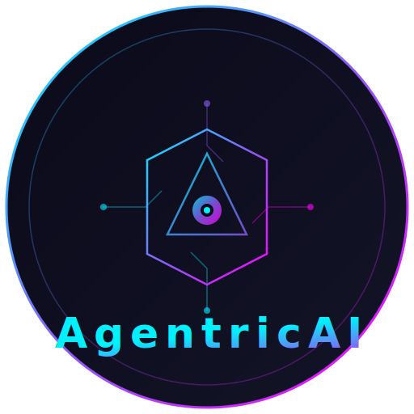

<p align="center">
  
</p>

<h1 align="center">AgentricAI — IED (Integrated Execution Desktop)</h1>

<p align="center">
  <strong>Multi-Agent Orchestration Platform for Local LLM Workflows</strong>
</p>

<p align="center">
  <a href="https://github.com/BAMmyers/AgentricAI-IED-ollama"></a>
  
  
  
  
  
  
  
  
</p>

<p align="center">
  <a href="#installation">Installation</a> •
  <a href="#features">Features</a> •
  <a href="#usage">Usage</a> •
  <a href="#terminal-commands">Commands</a> •
  <a href="#contributing">Contributing</a>
</p>

<p align="center">
  A futuristic, dark-themed IDE for orchestrating 101 specialized AI agents powered by <a href="https://ollama.ai">Ollama</a> for fully offline, privacy-first LLM execution.
</p>

---

## 🚀 Quick Start

```bash
# Clone the repository
git clone https://github.com/BAMmyers/AgentricAI-IED-ollama.git
cd AgentricAI-IED-ollama

# Install dependencies
npm install

# Start Ollama (in a separate terminal)
ollama serve

# Pull the default model
ollama pull AgentricAIcody

# Start the development server
npm run dev

# Open http://localhost:5173 in your browser
```

---

## Table of Contents

- [Overview](#overview)
- [Features](#features)
- [Architecture](#architecture)
- [Agent System](#agent-system)
- [Prerequisites](#prerequisites)
- [Installation](#installation)
- [Configuration](#configuration)
- [Usage](#usage)
- [Terminal Commands](#terminal-commands)
- [API Reference](#api-reference)
- [Project Structure](#project-structure)
- [Development](#development)
- [Troubleshooting](#troubleshooting)
- [Contributing](#contributing)
- [License](#license)

---

## 📸 Screenshots

<details>
<summary>Click to expand screenshots</summary>

### Main Interface
> Dark-themed IDE with collapsible agent roster, code workspace, and terminal

### Agent Roster
> 101 agents organized into 19 collapsible category folders with search and filtering

### Workflow Builder
> Visual pipeline builder for chaining agents into multi-step workflows

### Chat Interface
> Real-time streaming chat with agents, powered by Ollama

### Terminal
> Integrated command-line interface with agent commands and debug logging

*Screenshots coming soon — run the app locally to see the full interface!*

</details>

---

## Overview

AgentricAI is a browser-based multi-agent orchestration platform designed for developers, researchers, and security professionals who need to coordinate multiple specialized AI agents for complex workflows. Unlike cloud-dependent solutions, AgentricAI runs entirely on your local machine using Ollama as the LLM backend, ensuring:

- **Complete Privacy**: All data stays on your machine
- **Offline Operation**: No internet required after initial model download
- **Zero API Costs**: Use your own hardware for inference
- **Full Control**: Customize agents, models, and workflows

### Design Philosophy

1. **No Simulated Responses**: Every AI response comes from real Ollama inference
2. **Transparent Logging**: All operations are logged for debugging and audit
3. **Modular Agents**: 101 pre-built agents across 19 categories, fully customizable
4. **Workflow-First**: Chain agents into sequential pipelines for complex tasks

---

## Features

### Core Capabilities

| Feature | Description |
|---------|-------------|
| **101 Pre-built Agents** | Specialized agents for security, development, research, quantum studies, and more |
| **19 Category Folders** | Organized agent roster with collapsible folders and search |
| **Workflow Builder** | Visual pipeline builder to chain agents into multi-step workflows |
| **Streaming Responses** | Real-time token-by-token output from Ollama |
| **Code Workspace** | Tabbed editor with syntax highlighting and line numbers |
| **Integrated Terminal** | Command-line interface for system operations |
| **File Explorer** | Hierarchical file tree with language-specific icons |
| **Debug Logging** | Comprehensive event logging with export to `debug-log.txt` |

### Agent Categories

| Category | Count | Purpose |
|----------|-------|---------|
| Consciousness | 3 | Persistent memory systems (Collective, Simulated, Theoretical) |
| Core \ System | 11 | Orchestration, security, logging, maintenance |
| Tool-Enabled | 5 | Python, Git, file system, image analysis |
| System \ OS | 2 | Process management, application launching |
| Data \ Integration | 8 | Data transformation, extraction, web crawling |
| Development \ Code | 7 | Code generation, refactoring, documentation |
| Content \ Language | 15 | Writing, translation, summarization, diagrams |
| Support | 6 | Tutoring, counseling, email drafting |
| Advanced Research \ Theory | 1 | Frontier science exploration |
| Academic \ Research | 7 | Physics, biology, chemistry, CS, astronomy, history, psychology |
| Quantum Studies | 8 | Quantum theory, fields, waves, energy, entanglement, algorithms |
| Security | 8 | Threat detection, anomaly detection, sandboxing |
| Security Enforcement | 5 | Isolation, blocking, quarantine, credential reset |
| Security Reporting | 3 | Incident reports, threat intel sync, audit trails |
| External Review \ Impact Analysis | 6 | Environmental, economic, human, ethical, regulatory review |
| Governance | 2 | Human approval gateway, policy compliance |
| Correlation | 2 | Event correlation, timeline reconstruction |
| Playbook Management | 1 | Response playbook storage and validation |
| Validation | 1 | Response validation for safety and correctness |

---

## Architecture

```
┌─────────────────────────────────────────────────────────────────────────┐
│                           AgentricAI Frontend                           │
│                         (React + TypeScript + Vite)                     │
├─────────────────────────────────────────────────────────────────────────┤
│                                                                         │
│  ┌─────────────┐  ┌─────────────────┐  ┌─────────────────────────────┐ │
│  │   Sidebar   │  │  Code Workspace │  │      Workflow Panel         │ │
│  │             │  │                 │  │                             │ │
│  │ • 19 Cats   │  │ • Tabbed Editor │  │ • Pipeline Builder          │ │
│  │ • 101 Agents│  │ • Chat View     │  │ • Step Execution            │ │
│  │ • Search    │  │ • File Editing  │  │ • Status Tracking           │ │
│  │ • Create    │  │ • Streaming     │  │ • Re-run Capability         │ │
│  └─────────────┘  └─────────────────┘  └─────────────────────────────┘ │
│                                                                         │
│  ┌─────────────────────────────────────────────────────────────────┐   │
│  │                      Terminal Panel                              │   │
│  │  • Command History  • Agent Commands  • Debug Logging            │   │
│  └─────────────────────────────────────────────────────────────────┘   │
│                                                                         │
├─────────────────────────────────────────────────────────────────────────┤
│                          useOllama Hook                                 │
│              (Streaming Chat, Generate, Model Discovery)                │
└───────────────────────────────┬─────────────────────────────────────────┘
                                │
                                │ HTTP (localhost:11434)
                                │
┌───────────────────────────────▼─────────────────────────────────────────┐
│                           Ollama Server                                 │
│                        (Local LLM Inference)                            │
├─────────────────────────────────────────────────────────────────────────┤
│  Models:                                                                │
│  • AgentricAIcody (default)    • dolphin-llama3      • qwen2.5-coder   │
│  • dolphin-uncensored          • glm-4.7-flash       • llama2-uncensored│
│  • AgentricAi/AgentricAI_LLaVa • CrimsonDragonX7/Luna                  │
└─────────────────────────────────────────────────────────────────────────┘
```

### Data Flow

1. **User Input** → Chat message or workflow trigger
2. **Agent Selection** → Agent's system prompt + model loaded
3. **Ollama Request** → Streaming POST to `/api/chat`
4. **Token Streaming** → Real-time display in UI
5. **Logging** → Event captured in debug log
6. **State Update** → Agent status, chat history, workflow progress

---

## Agent System

### Agent Interface

```typescript
interface Agent {
  id: string;           // Unique identifier (e.g., "agent-cc", "tool-1")
  name: string;         // Display name (e.g., "Collective Consciousness")
  role: string;         // Detailed description of agent's purpose
  color: string;        // Hex color for UI theming
  status: 'idle' | 'running' | 'success' | 'error';
  model: string;        // Ollama model name (e.g., "AgentricAIcody")
  tools: string[];      // Available tools (e.g., ["python", "fileSystem"])
  temperature: number;  // LLM temperature (0.0 - 2.0)
  maxTokens: number;    // Maximum response tokens
  systemPrompt: string; // System prompt defining agent behavior
  category: string;     // Category folder (e.g., "Security")
  logic: 'local' | 'remote' | 'hybrid';  // Execution mode
}
```

### Model Assignments

| Agent Type | Default Model | Rationale |
|------------|---------------|-----------|
| Core System, Security, Development | `AgentricAIcody` | High-capability general purpose |
| Academic, Research, Content | `dolphin-llama3` | Strong reasoning and knowledge |
| Code Analysis, Validation | `qwen2.5-coder` | Code-optimized model |
| Creative, Theoretical | `dolphin-uncensored` | Unrestricted creative output |
| Image Analysis | `AgentricAi/AgentricAI_LLaVa` | Vision-language model |

### Creating Custom Agents

Via the UI:
1. Click **"+ Create Agent"** in the sidebar
2. Configure name, role, category, model, tools, and system prompt
3. Agent appears in the appropriate category folder

Programmatically (in `agentRoster.ts`):
```typescript
import { makeAgent } from './agentRoster';

const myAgent = makeAgent(
  'custom-001',                    // id
  'MyCustomAgent',                 // name
  'Performs specialized analysis', // role
  'AgentricAIcody',                // model
  ['read_file', 'write_file'],     // tools
  'Custom Category',               // category
  0.7,                             // temperature
  4096                             // maxTokens
);
```

---

## Prerequisites

### Required

| Dependency | Version | Purpose |
|------------|---------|---------|
| [Node.js](https://nodejs.org/) | ≥18.0.0 | JavaScript runtime |
| [npm](https://www.npmjs.com/) | ≥9.0.0 | Package manager |
| [Ollama](https://ollama.ai/) | ≥0.1.0 | Local LLM server |

### Recommended Models

```bash
# Default model (required)
ollama pull AgentricAIcody

# Additional models for specialized agents
ollama pull qwen2.5-coder
ollama pull dolphin-llama3
ollama pull dolphin-uncensored
ollama pull glm-4.7-flash

# Optional: Vision model for image analysis
ollama pull llava
```

---

## Installation

### 1. Clone the Repository

```bash
git clone https://github.com/BAMmyers/AgentricAI-IED-ollama.git
cd AgentricAI-IED-ollama
```

### 2. Install Dependencies

```bash
npm install
```

### 3. Start Ollama Server

```bash
# In a separate terminal
ollama serve
```

### 4. Start Development Server

```bash
npm run dev
```

### 5. Open in Browser

Navigate to `http://localhost:5173`

### Production Build

```bash
npm run build
npm run preview
```

---

## Configuration

### Ollama Endpoint

Default: `http://localhost:11434`

To use a different endpoint, modify `src/hooks/useOllama.ts`:

```typescript
const OLLAMA_BASE_URL = 'http://your-ollama-host:11434';
```

### Default Model

To change the default model, edit `src/hooks/useOllama.ts`:

```typescript
export const DEFAULT_MODEL = 'your-preferred-model';
```

### Agent Roster

All agents are defined in `src/data/agentRoster.ts`. To modify:

1. Edit agent properties directly in the file
2. Add/remove agents from category arrays
3. Update `CATEGORY_ORDER` for display ordering

### Styling

- **Colors**: `src/index.css` (CSS variables)
- **Tailwind**: `tailwind.config.js`
- **Component styles**: Inline Tailwind classes

---

## Usage

### Chat with an Agent

1. Click an agent in the sidebar
2. Type your message in the chat input
3. Press Enter or click Send
4. Watch the streaming response

### Create a Workflow

1. Click the **Workflows** tab (or press the workflow icon)
2. Click **"+ New Workflow"**
3. Enter workflow name and description
4. Click **"+ Add Step"** for each agent in the pipeline
5. Configure each step's prompt
6. Click **"Run Workflow"**

### File Editing

1. Click a file in the File Explorer
2. Edit in the Code Workspace
3. Changes are held in memory (implement save logic as needed)

---

## Terminal Commands

| Command | Description |
|---------|-------------|
| `help` | Display all available commands |
| `clear` | Clear terminal output |
| `agents` | List all agents grouped by category |
| `status` | Show Ollama connection status and active agents |
| `models` | List available Ollama models |
| `workflows` | List all defined workflows |
| `run <workflow>` | Execute a workflow by name |
| `init` | Initialize all 101 agents with basic health check |
| `pull <model>` | Pull a new model from Ollama registry |
| `log` | Download debug log as `debug-log.txt` |
| `default` | Show default model information |

### Example Session

```bash
> status
[AgentricAI] Connection Status: ● Connected to Ollama
[AgentricAI] Active agents: 3/101
[AgentricAI] Default model: AgentricAIcody

> agents
📁 Consciousness (3)
   • Collective Consciousness
   • Simulated Consciousness
   • Theoretical Consciousness
📁 Core \ System (11)
   • APIGateway
   • AgentricAI_001
   ...

> init
[AgentricAI] Starting agent initialization...
[AgentricAI] Initializing Collective Consciousness (AgentricAIcody)...
[AgentricAI] ✓ Collective Consciousness initialized (1.2s)
...
[AgentricAI] Initialization complete. 101/101 agents ready.

> log
[AgentricAI] Downloading debug-log.txt...
```

---

## API Reference

### useOllama Hook

```typescript
import { useOllama, DEFAULT_MODEL } from './hooks/useOllama';

const {
  isConnected,      // boolean - Ollama server reachable
  models,           // OllamaModel[] - Available models
  isLoading,        // boolean - Request in progress
  streamingMessage, // string - Current streaming response
  error,            // string | null - Last error message
  sendMessage,      // (messages, model, onToken?) => Promise<string>
  generateResponse, // (prompt, model, system?) => Promise<string>
  pullModel,        // (modelName) => Promise<void>
  abortRequest,     // () => void - Cancel current request
  checkConnection,  // () => Promise<void>
} = useOllama();
```

### sendMessage

Send a chat message with conversation history:

```typescript
const response = await sendMessage(
  [
    { role: 'system', content: 'You are a helpful assistant.' },
    { role: 'user', content: 'Hello!' }
  ],
  'AgentricAIcody',
  (token) => console.log('Token:', token)  // Optional streaming callback
);
```

### generateResponse

Single-shot generation without history:

```typescript
const response = await generateResponse(
  'Explain quantum entanglement',
  'dolphin-llama3',
  'You are a physics professor.'  // Optional system prompt
);
```

### Ollama REST API

AgentricAI communicates with Ollama via HTTP:

| Endpoint | Method | Purpose |
|----------|--------|---------|
| `/api/tags` | GET | List available models |
| `/api/chat` | POST | Streaming chat completion |
| `/api/generate` | POST | Single-shot generation |
| `/api/pull` | POST | Download a model |

---

## Project Structure

```
agentric-ai/
├── public/
│   └── logo.svg                 # AgentricAI logo
├── src/
│   ├── components/
│   │   ├── CodeWorkspace.tsx    # Tabbed editor + chat view
│   │   ├── CreateAgentModal.tsx # Agent creation form
│   │   ├── FileTree.tsx         # File explorer component
│   │   ├── Sidebar.tsx          # Agent roster with categories
│   │   ├── TerminalPanel.tsx    # Command-line interface
│   │   └── WorkflowPanel.tsx    # Workflow builder
│   ├── data/
│   │   └── agentRoster.ts       # 101 agent definitions
│   ├── hooks/
│   │   └── useOllama.ts         # Ollama API integration
│   ├── utils/
│   │   └── cn.ts                # Tailwind class merger
│   ├── App.tsx                  # Main application component
│   ├── index.css                # Global styles + dark theme
│   ├── main.tsx                 # React entry point
│   └── types.ts                 # TypeScript interfaces
├── index.html                   # HTML template
├── package.json                 # Dependencies
├── tailwind.config.js           # Tailwind configuration
├── tsconfig.json                # TypeScript configuration
├── vite.config.ts               # Vite configuration
└── README.md                    # This file
```

---

## Development

### Scripts

| Command | Description |
|---------|-------------|
| `npm run dev` | Start development server with HMR |
| `npm run build` | Production build to `dist/` |
| `npm run preview` | Preview production build |
| `npm run lint` | Run ESLint |

### Adding a New Agent Category

1. Add category to `CATEGORY_ORDER` in `agentRoster.ts`
2. Add color to `CATEGORY_COLORS`
3. Add icon to `CATEGORY_ICONS`
4. Create agents with `makeAgent()` and add to `DEFAULT_AGENTS`
5. Add category to `CreateAgentModal.tsx` dropdown

### Adding a New Terminal Command

In `App.tsx`, find the `handleTerminalCommand` function:

```typescript
case 'mycommand':
  addLine('output', 'My command output');
  logDebug('TERMINAL', 'mycommand executed');
  break;
```

### Customizing the Theme

Edit CSS variables in `src/index.css`:

```css
:root {
  --color-void: #030712;
  --color-abyss: #0a0f1a;
  --color-deep: #111827;
  --color-surface: #1f2937;
  --color-elevated: #374151;
  --color-cyan: #22d3ee;
  --color-magenta: #e879f9;
  --color-violet: #8b5cf6;
}
```

---

## Troubleshooting

### Ollama Connection Failed

```
Error: Failed to connect to Ollama
```

**Solutions:**
1. Ensure Ollama is running: `ollama serve`
2. Check Ollama is on port 11434: `curl http://localhost:11434/api/tags`
3. Check firewall settings
4. Verify no other process is using port 11434

### Model Not Found

```
Error: model 'AgentricAIcody' not found
```

**Solutions:**
1. Pull the model: `ollama pull AgentricAIcody`
2. Check available models: `ollama list`
3. Use terminal command: `models` to see what's available

### Slow Responses

**Solutions:**
1. Use a smaller model (e.g., `dolphin-phi` instead of `dolphin-llama3`)
2. Reduce `maxTokens` in agent configuration
3. Ensure sufficient RAM/VRAM for the model
4. Check GPU utilization: `nvidia-smi` (if using NVIDIA GPU)

### Build Errors

```bash
# Clear cache and reinstall
rm -rf node_modules package-lock.json
npm install

# Clear Vite cache
rm -rf .vite
npm run build
```

---

## Contributing

### Code Style

- TypeScript strict mode enabled
- Functional components with hooks
- Tailwind CSS for styling (no external CSS files)
- Descriptive variable names
- JSDoc comments for complex functions

### Pull Request Process

1. Fork the repository at [github.com/BAMmyers/AgentricAI-IED-ollama](https://github.com/BAMmyers/AgentricAI-IED-ollama)
2. Create a feature branch: `git checkout -b feature/my-feature`
3. Make changes and test thoroughly
4. Ensure build passes: `npm run build`
5. Submit PR at [github.com/BAMmyers/AgentricAI-IED-ollama/pulls](https://github.com/BAMmyers/AgentricAI-IED-ollama/pulls)

### Agent Contributions

When contributing new agents:
- Use `makeAgent()` factory function
- Assign appropriate category
- Choose suitable model for the task
- Write clear, specific role descriptions
- Test with real Ollama inference

---

## License

MIT License

Copyright (c) 2024 BAMmyers / AgentricAI Studios

Permission is hereby granted, free of charge, to any person obtaining a copy
of this software and associated documentation files (the "Software"), to deal
in the Software without restriction, including without limitation the rights
to use, copy, modify, merge, publish, distribute, sublicense, and/or sell
copies of the Software, and to permit persons to whom the Software is
furnished to do so, subject to the following conditions:

The above copyright notice and this permission notice shall be included in all
copies or substantial portions of the Software.

THE SOFTWARE IS PROVIDED "AS IS", WITHOUT WARRANTY OF ANY KIND, EXPRESS OR
IMPLIED, INCLUDING BUT NOT LIMITED TO THE WARRANTIES OF MERCHANTABILITY,
FITNESS FOR A PARTICULAR PURPOSE AND NONINFRINGEMENT. IN NO EVENT SHALL THE
AUTHORS OR COPYRIGHT HOLDERS BE LIABLE FOR ANY CLAIM, DAMAGES OR OTHER
LIABILITY, WHETHER IN AN ACTION OF CONTRACT, TORT OR OTHERWISE, ARISING FROM,
OUT OF OR IN CONNECTION WITH THE SOFTWARE OR THE USE OR OTHER DEALINGS IN THE
SOFTWARE.

---

<p align="center">
  <strong>Built with 🧠 by <a href="https://github.com/BAMmyers">BAMmyers</a> / AgentricAI Studios</strong>
</p>

<p align="center">
  <a href="https://github.com/BAMmyers/AgentricAI-IED-ollama/issues">Report Bug</a> •
  <a href="https://github.com/BAMmyers/AgentricAI-IED-ollama/issues">Request Feature</a> •
  <a href="https://github.com/BAMmyers/AgentricAI-IED-ollama/pulls">Submit PR</a>
</p>
